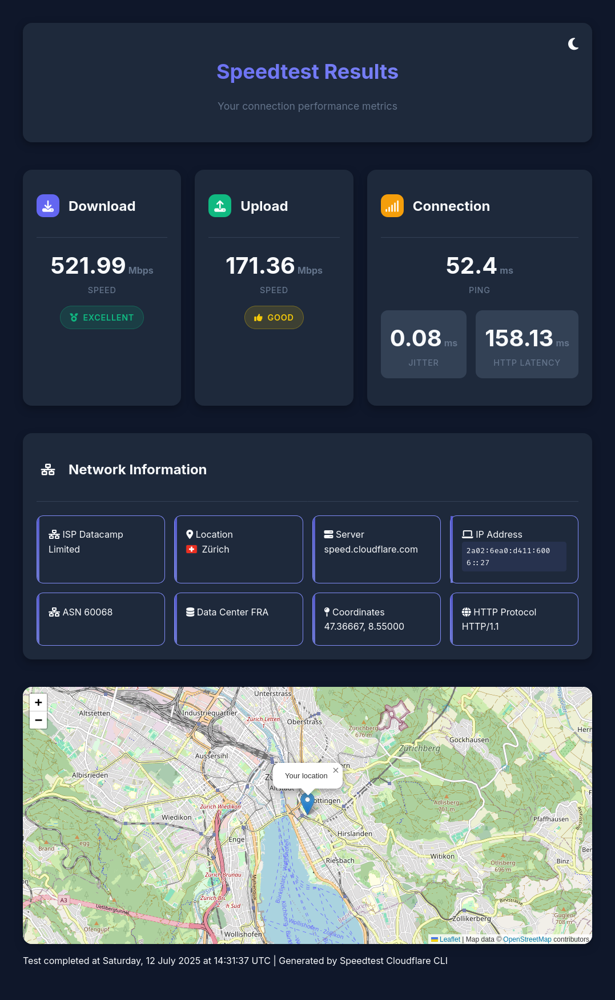
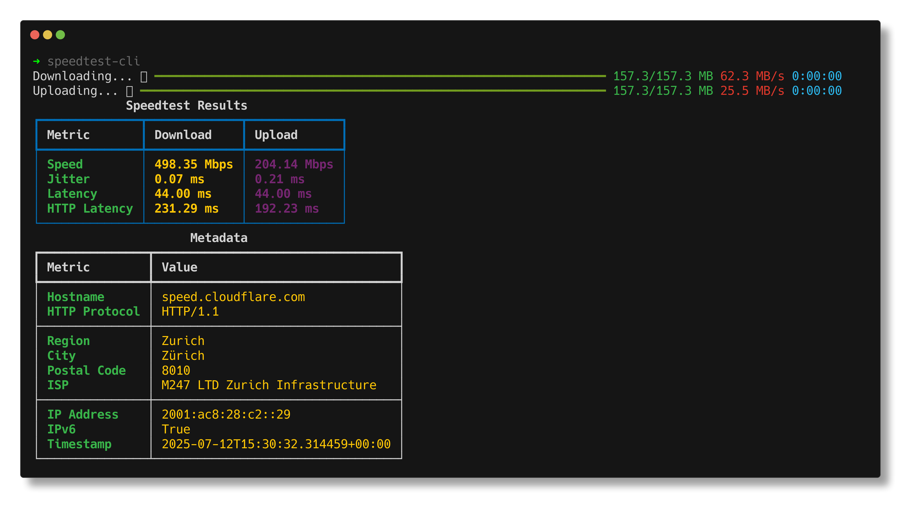
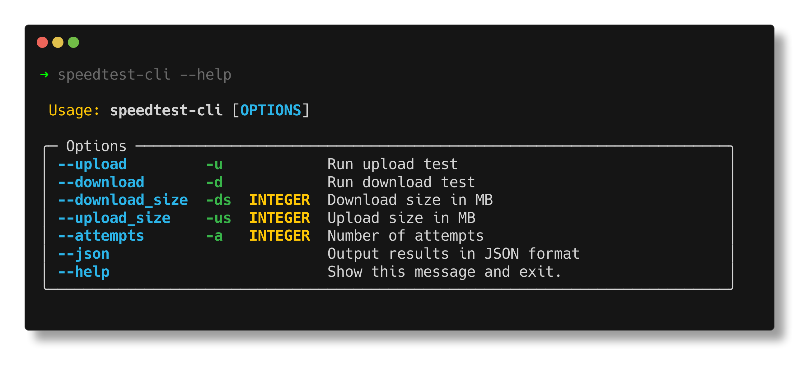

<p align="center">
  
</p>

# speedtest-cli


[](https://img.shields.io/github/v/release/takitsu21/speedtest)
[](https://github.com/takitsu21/speedtest/actions/workflows/test.yml)
[](https://github.com/takitsu21/speedtest/actions/workflows/deploy.yml)
[](https://img.shields.io/github/commit-activity/m/takitsu21/speedtest)
[](https://img.shields.io/github/license/takitsu21/speedtest)




## Installation

I strongly recommend to use [pipx](https://github.com/pypa/pipx/tree/main) or [uv](https://github.com/astral-sh/uv) to install this tool.
These tools will install the package in an isolated environment and will not interfere with your system packages.

### Using pipx
```bash
pipx install speedtest-cloudflare-cli
```

### Using uv
```bash
uv tool install speedtest-cloudflare-cli
```

### Using pip
> [!WARNING]
>
> It is not recommended to install this package using pip. It will install the package in your system packages and may interfere with other packages.

```bash
pip install speedtest-cloudflare-cli
```

## Features

- ⏱️ **Time-Based Testing** - 10 second default timeout per test for consistent, fast results
- 🚀 **Adaptive Test Sizing** - Automatically adjusts test size based on your connection speed
- 📊 **Comprehensive Metrics** - Download/upload speed, ping, jitter, and HTTP latency
- 🌍 **Cloudflare Infrastructure** - Tests using Cloudflare's global network
- 🎨 **Beautiful Output** - Rich terminal interface with progress bars and tables
- 📄 **Multiple Output Formats** - Console, JSON, and interactive web dashboard
- 🔒 **Privacy Focused** - No tracking, no accounts, open source

## Usage

Run the following command to test your internet speed.

```bash
speedtest-cli
```



By default, each test (download/upload) runs for **10 seconds** and calculates speed based on data transferred. You can customize the timeout:

```bash
# 5 second timeout per test
speedtest-cli --timeout 5

# 20 second timeout for more accuracy
speedtest-cli --timeout 20
```

For more information, run the --help command.
```bash
speedtest-cli --help
```



## Running in a container

### Using Podman

```bash
podman run --rm -it ghcr.io/takitsu21/speedtest:latest
```

### Using Docker

```bash
docker run --rm -it ghcr.io/takitsu21/speedtest:latest
```