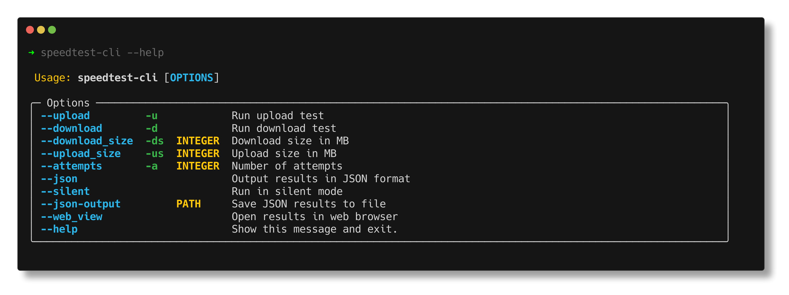

# speedtest-cli


[](https://img.shields.io/github/v/release/takitsu21/speedtest)
[](https://github.com/takitsu21/speedtest/actions/workflows/test.yml)
[](https://github.com/takitsu21/speedtest/actions/workflows/deploy.yml)
[](https://img.shields.io/github/commit-activity/m/takitsu21/speedtest)
[](https://img.shields.io/github/license/takitsu21/speedtest)

Speed CLI tool to test your network connectivity

## Installation

I strongly recommend to use [pipx](https://github.com/pypa/pipx/tree/main) or [uv](https://github.com/astral-sh/uv) to install this tool.
These tools will install the package in an isolated environment and will not interfere with your system packages.

### Using pipx
```bash
pipx install speedtest-cloudflare-cli
```

### Using uv
```bash
uv tool install speedtest-cloudflare-cli
```

### Using pip
> [!WARNING]
>
> It is not recommended to install this package using pip. It will install the package in your system packages and may interfere with other packages.

```bash
pip install speedtest-cloudflare-cli
```

## Usage

Run the following command to test your internet speed.

```bash
speedtest-cli
```


For more information, run the --help command.
```bash
speedtest-cli --help
```



## Running in a container

> [!WARNING]
>
> You may encounter permission issues when running the container due to ping command. To avoid this, you can run the container with the `-u 0:0` flag.

### Using Podman

```bash
podman run --rm -it -u 0:0 takizz21/speedtest:latest
```

### Using Docker

```bash
docker run --rm -it -u 0:0 takizz21/speedtest:latest
```
